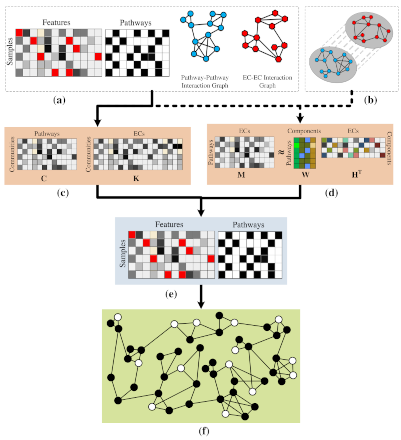

## Basic Description

This repo contains an implementation of triUMPF (**tri**ple non-negative matrix factorization with comm**U**nity
detection to **M**etabolic **P**athway in**F**erence) that combines three stages of NMF to capture relationships between
enzymes and pathways within a network followed by community detection to extract higher order structure based on the
clustering of vertices sharing similar functional features. We evaluated triUMPF performance using experimental datasets
manifesting diverse multi-label properties, including Tier 1 genomes from the BioCyc collection of organismal
Pathway/Genome Databases and low complexity microbial communities. Resulting performance metrics equaled or exceeded
other prediction methods on organismal genomes with improved prediction outcomes on multi-organism data sets.

The three E.coli genomes can be access from [here](src/sample). The indices correspond: 0 to Escherichia coli CFT073, 1
to Escherichia coli O157:H7 str. EDL933, and 2 to Escherichia coli str. MG1655:

- "three_ecoli_X.pkl": three E.coli data of size (3, 3650).
- "three_ecoli_Xe.pkl": three E.coli data of size (3, 3778).
- "three_ecoli_triumpf_y.pkl": triUMPF (using triUMPF.pkl) predicted pathways on the three E.coli data of size (3, 2526)
  .
- "three_ecoli_taxprune_pathologic_y.pkl": Pathologic (with taxonomic pruning option) predicted pathways on the E.coli
  data of size (3, 2526).
- "three_ecoli_notaxprune_pathologic_y.pkl": Pathologic (excluding taxonomic pruning option) predicted pathways on the
  three E.coli data of size (3, 2526).

See tutorials on the [GitHub wiki](https://github.com/hallamlab/triUMPF/wiki) page for more information and guidelines.

## Citing

If you find *triUMPF* useful in your research, please consider citing the following paper:

- M. A. Basher, Abdur Rahman, McLaughlin, Ryan J., and Hallam, Steven
  J.. **["Metabolic pathway prediction using non-negative matrix factorization with improved precision"](https://doi.org/10.1101/2020.05.27.119826)**
  , bioRxiv (2021).

## Contact

For any inquiries, please contact: [arbasher@student.ubc.ca](mailto:arbasher@student.ubc.ca)
