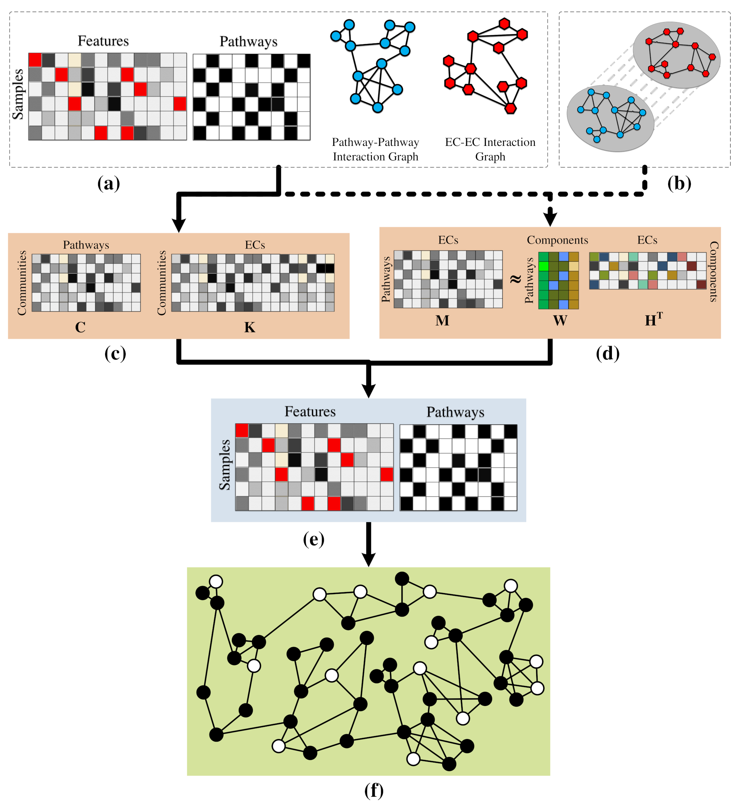

## Basic Description
This repo contains an implementation of triUMPF(**tri**ple non-negative matrix factorization with comm**u**nity detection to **m**etabolic **p**athway in**f**erence) that combines three stages of NMF to capture relationships between enzymes and pathways within a network followed by community detection to extract higher order structure based on the clustering of vertices sharing similar functional features. We evaluated triUMPF performance using experimental datasets manifesting diverse multi-label properties, including Tier 1 genomes from the BioCyc collection of organismal Pathway/Genome Databases and low complexity microbial communities. Resulting performance metrics equaled or exceeded other prediction methods on organismal genomes with improved prediction outcomes on multi-organism data sets.

## Dependencies

- *triUMPF* is tested to work under Python 3.5
- [Anaconda](https://www.anaconda.com/)
- [NumPy](http://www.numpy.org/) (>= 1.15)
- [scikit-learn](https://scikit-learn.org/stable/) (>= 0.20)
- [pandas](http://pandas.pydata.org/) (>= 0.23)
- [NetworkX](https://networkx.github.io/) (>= 2.2)
- [scipy](https://www.scipy.org/index.html)

## Objects
- Please download the files: "ec_graph.pkl", "compound_graph.pkl", "pathway_graph.pkl", "ec2compound.pkl", "compound2pathway.pkl", and "ec2pathway.pkl" from: [HallamLab](https://github.com/hallamlab)
- You need to generate a heterogeneous information network. A sample can be obtained for the experimental purposes from [hin.pkl](https://github.com/hallamlab).

## Basic Usage
To display *triUMPF*'s running options, use: `python main.py --help`. It should be self-contained. 
### Preprocessing graph
To preprocess graphs, we provide few examples:
#### Example 1
To preprocess three layer graph **all connected**, execute the following command:
``python main.py --preprocess-dataset --first-graph-name "ec_graph.pkl" --second-graph-name "compound_graph.pkl" --third-graph-name "pathway_graph.pkl" --first-mapping-file-name "ec2compound.pkl" --second-mapping-file-name "compound2pathway.pkl" --hin-file "[Name of the hin file].pkl" --ospath [LOCATION to ALL the Files] --num-jobs 2``
where *--hin-file* corresponds to the desired generated file name, ending with *.pkl*.

#### Example 2
To preprocess three layer graph **excluding the connection of the first graph**, execute the following command:
``python main.py --preprocess-dataset --first-graph-not-connected --first-graph-name "ec_graph.pkl" --second-graph-name "compound_graph.pkl" --third-graph-name "pathway_graph.pkl" --first-mapping-file-name "ec2compound.pkl" --second-mapping-file-name "compound2pathway.pkl" --hin-file "[Name of the hin file].pkl" --ospath [LOCATION to ALL the Files] --num-jobs 2``
where *--hin-file* corresponds to the desired generated file name, ending with *.pkl*. The argument *--first-graph-not-connected* enables exclusion of connection among the nodes in the first layer.

#### Example 3
To preprocess three layer graph while **removing isolates**, execute the following command:
``python main.py --preprocess-dataset --remove-isolates --first-graph-name "ec_graph.pkl" --second-graph-name "compound_graph.pkl" --third-graph-name "pathway_graph.pkl" --first-mapping-file-name "ec2compound.pkl" --second-mapping-file-name "compound2pathway.pkl" --hin-file "[Name of the hin file].pkl" --ospath [LOCATION to ALL the Files] --num-jobs 2``
where *--hin-file* corresponds to the desired generated file name, ending with *.pkl*. The argument *--remove-isolates* enables the isolation of nodes less than 2 connectivity.

#### Example 4
To preprocess **two layers graph**, execute the following command:
``python main.py --preprocess-dataset --exclude-third-graph --first-graph-name "ec_graph.pkl" --second-graph-name "pathway_graph.pkl" --first-mapping-file-name "ec2pathway.pkl" --hin-file "[Name of the hin file].pkl" --ospath [LOCATION to ALL the Files] --num-jobs 2``
where *--hin-file* corresponds to the desired generated file name, ending with *.pkl*. The argument *--exclude-third-graph* enables the including two layers only.

### Generate Walks
To generate walks, we provide few examples:
#### Example 1
To generate *node2vec* random walks, execute the following command:
``python main.py --extract-instance --q 0.5 --hin-file "[Name of the hin file].pkl" --file-name "[Name of the file without extension]" --ospath [Location to the hin file] --dspath [Location to store the generated walks] --num-jobs 10``
where *--file-name* corresponds to the desired file name, excluding any *EXTENSION*. The file will have *.txt* extension. The argument *--q* represents in-out parameter that allows the search to differentiate between "inward" and "outward" nodes. The return parameter that controls the likelihood of immediately revisiting a node in the walk will be automatically adjusted.

#### Example 2
To generate *metapath2vec* random walks, execute the following command:
``python main.py --extract-instance --metapath-scheme "ECTCE" --use-metapath-scheme --hin-file "[Name of the hin file].pkl" --file-name "[Name of the file without extension]" --ospath [Location to the hin file] --dspath [Location to store the generated walks] --num-jobs 10``
where *--file-name* corresponds to the desired file name, excluding any *EXTENSION*. The file will have *.txt* extension.

#### Example 3
To generate *JUST* random walks, execute the following command:
``python main.py --extract-instance --q 0.5 --just-type --just-memory-size 2 --hin-file "[Name of the hin file].pkl" --file-name "[Name of the file without extension]" --ospath [Location to the hin file] --dspath [Location to store the generated walks] --num-jobs 10``
where *--file-name* corresponds to the desired file name, excluding any *EXTENSION*. The file will have *.txt* extension.

#### Example 4
To generate *RUST* random walks, execute the following command with :
``python main.py --extract-instance --burn-in-phase 3 --q 0.3 --just-type --just-memory-size 3 --hin-file "[Name of the hin file].pkl" --file-name "[Name of the file without extension]" --ospath [Location to the hin file] --dspath [Location to store the generated walks] --num-jobs 10``
where *--file-name* corresponds to the desired file name, excluding any *EXTENSION*. The file will have *.txt* extension. The argument *--q* represents the probability to explore within layer nodes (breadth-search). The in-depth search will be automatically adjusted based on unit circle equation.

### Train
To learn embeddings using the random walks, we provide few examples:
#### Example 1
To learn embeddings using dimension size *--embedding-dim* 128, context size *--window-size* 3, Number of samples to be considered within defined context size *--num-skips* 2, execute the following command:
``python main.py --train --embedding-dim 128 --num-skips 2 --window-size 3 --hin-file "[Name of the hin file].pkl" --file-name "[Name of the .txt file]" --model-name "[Model name without extension]" --mdpath [Location for storing the learned embeddings] --rspath [Location for storing costs] --num-epochs 1 --num-jobs 10``
where *--file-name* corresponds to the *.txt* generate walks and *--model-name* corresponds the name of the models (excluding any *EXTENSION*). The model name will have *.npz* extension. 

#### Example 2
To learn embeddings using the same above parameter settings but with *metapath2vec++*, execute the following command:
``python main.py --train --constraint-type --embedding-dim 128 --num-skips 2 --window-size 3 --hin-file "[Name of the hin file].pkl" --file-name "[Name of the .txt file]" --model-name "[Model name without extension]" --mdpath [Location for storing the learned embeddings] --rspath [Location for storing costs] --num-epochs 1 --num-jobs 10``
where *--file-name* corresponds to the *.txt* generate walks, *--model-name* corresponds the name of the models, excluding any *EXTENSION*. The model name will have *.npz* extension, and *--constraint-type* enables the normalized skip gram model.

#### Example 2
To learn embeddings using the same above parameter settings but with *metapath2vec++* and trained using *gensim* package, execute the following command:
``python main.py --train --fit-by-word2vec --constraint-type --embedding-dim 128 --num-skips 2 --window-size 3 --hin-file "[Name of the hin file].pkl" --file-name "[Name of the .txt file]" --model-name "[Model name without extension]" --mdpath [Location for storing the learned embeddings] --rspath [Location for storing costs] --num-epochs 1 --num-jobs 10``
where *--file-name* corresponds to the *.txt* generate walks, *--model-name* corresponds the name of the models, excluding any *EXTENSION*. The model name will have *.npz* extension, *--constraint-type* enables the normalized skip gram model, and *fit-by-word2vec* enables to train using gensim package.

## Citing
If you employ _path2vec_ in your research, please consider citing the following paper presented at PLOS 2019:
- M. A. Basher, Abdur Rahman, and Steven J. Hallam. **["pathway2vec: Learning Metabolic Pathways Representations as Graph Heterogeneous Network."](https://github.com/atante/xXx.pdf)**, Proceedings of xXx (2019).

## Contact
For any inquiries, please contact: [arbasher@alumni.ubc.ca](mailto:arbasher@alumni.ubc.ca)

## To do list
- Make the random walks generation more efficient.
